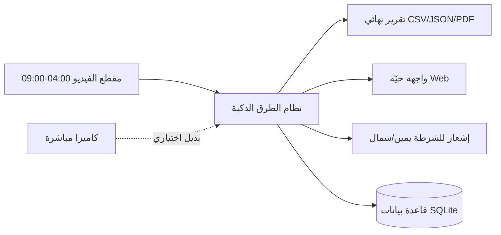
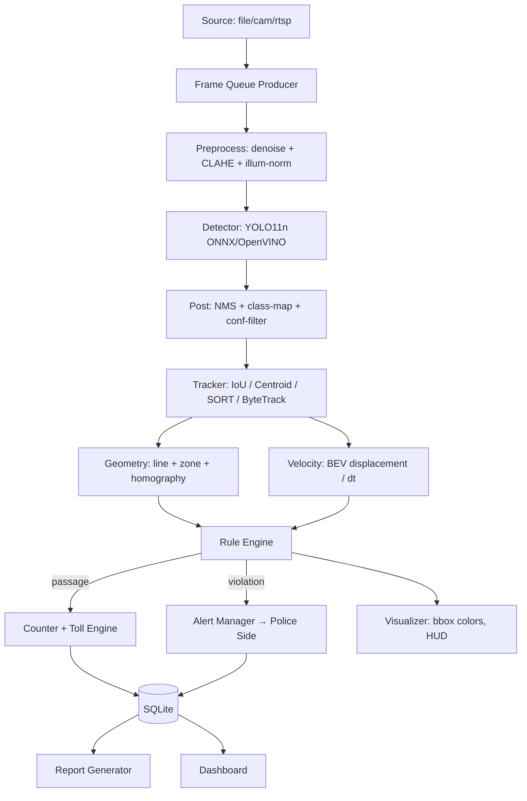

# هندسة نظام المرور الذكي (Smart Toll Road System) — خطة بناء كاملة

> مشتق من `docs/code_artifact.md` — الهدف: تحويل التوصيف إلى نظام برمجي متكامل قابل للتشغيل والتوسعة والاختبار.
> هذا المخطط وثيقة عمل للمراجعة والنقاش — كل بند فيه قابل للتعديل.

---

## 0. ملخص النظام (System Summary)

نظام **خط أنابيب فيديو (Video Pipeline)** يقرأ مقطعًا/كاميرا، يطبّق معالجة مسبقة، يكتشف المركبات بـ **YOLO11n**، يتتبعها، يحسب سرعتها في إحداثيات أرضية (BEV)، ثم يطبّق **قواعد عمل (Business Rules)** لتوليد ثلاثة مخرجات:

| المخرج | النوع | الوصف |
|---|---|---|
| **الحدث** | `Passage` | عدّ مركبة عبر الخط + نوعها + اتجاهها + الرسم المستحق |
| **المخالفة** | `Violation` | دراجة نارية مخالفة / تجاوز سرعة |
| **التقرير** | `Report` | جدول (اتجاه × نوع) + إجمالي الدخل + قائمة المخالفات |

وفوق ذلك طبقة **خدمات**: تخزين، إشعارات (للشرطة)، لوحة عرض حيّة، توليد تقارير، تقييم.

### الجملة المعمارية في سطر واحد
```
مصدر الفيديو → معالجة مسبقة → كشف (YOLO11n) → تتبع → سرعة/اتجاه → قواعد → أحداث
                                                                        ↓
                                       مخرجات: رسم حي / إشعار شرطة / تقرير نهائي
```

---

## 1. الحدود والنطاق (Scope)

### داخل النطاق (In Scope)
- مقطع الاختبار (04:00 → 09:00) + مقاطع تقييم إضافية (ليل/مطر).
- 6 فئات: `car`, `van`, `bus`, `truck`, `motorcycle`, `traffic-police motorcycle`.
- عدّ ثنائي الاتجاه (ذهاب/إياب) بدون ازدواج.
- احتساب الرسوم، إنذار مخالفة الدراجات، رصد السرعة، التقرير النهائي.
- تشغيل على CPU (8 أنوية) بدون GPU.
- Fine-tuning لـ YOLO11n لإضافة `van` + `traffic-police motorcycle`.

### خارج النطاق (Out of Scope)
- التحكم الفعلي في البوابات/الحاجز المادي.
- ربطه مع أنظمة شرطة حقيقية (نوفّر واجهة محاكاة عبر webhook).
- القيادة الذاتية أو التعرّف على اللوحات.

---

## 2. الممثلون والأنظمة الخارجية (Actors & External Systems)

```
┌────────────────┐   ┌──────────────────┐   ┌──────────────────────┐
│  كاميرا / ملف  │   │  مشغّل النظام    │   │  شرطي على الجانب A    │
│  (Camera/File) │──▶│  (Orchestrator)  │──▶│  (يستقبل الإشعار)     │
└────────────────┘   └────────┬─────────┘   └──────────────────────┘
                                │
        ┌───────────────┬───────┴────────┬──────────────────┐
        ▼               ▼                ▼                  ▼
   [Detector]      [Tracker]        [Event Log]        [Dashboard]
   YOLO11n         IoU/SORT         (SQLite)          (WebSocket)
        │               │                │
        └────► [Rule Engine: toll / speed / moto] ────► [Notifiers]
                                                          Console/Log/
                                                          Webhook/MQTT
```

---

## 3. معمارية النظام (System Architecture)

### 3.1 المعاينة المعمارية (Context Diagram)


### 3.2 خط الأنابيب (Runtime Pipeline)


**مبدأ التصميم:** كل مرحلة هي **class مستقلة** لها `input → output` واضح، تُبنى وتُختبر بشكل منفصل. هذا يجعل استبدال أي مرحلة (مثل tracker أو detector) بلا تأثير على باقي النظام.

---

## 4. الوحدات البرمجية (Modules)

| # | الوحدة | المسؤولية | ملف مقترح |
|---|---|---|---|
| 1 | `source` | قراءة الفيديو/كاميرا/RTSP بـ threaded reader + frame skip محسوب | `pipeline/source.py` |
| 2 | `preprocess` | فلاتر OpenCV: denoise، CLAHE، تطبيع إضاءة، gamma، محاكاة مطر | `pipeline/preprocess.py` |
| 3 | `detector` | YOLO11n (Ultralytics/ONNX/OpenVINO) + NMS + Confidence map للفئات | `pipeline/detector.py` |
| 4 | `tracker` | إسناد `track_id` ثابت + إدارة الـ lifecycle | `pipeline/tracker.py` |
| 5 | `geometry` | خط/منطقة العبور لكل اتجاه، نقاط ground-plane، homography | `pipeline/geometry.py` |
| 6 | `velocity` | تقدير السرعة m/s من الإزاحة في BEV + تنعيم (EMA/Kalman) | `pipeline/velocity.py` |
| 7 | `rules` | منطق العمل: رسوم، اتجاه، مخالفة موتور، مخالفة سرعة | `pipeline/rules.py` |
| 8 | `annotator` | رسم BBox بالألوان + HUD + counters | `pipeline/annotator.py` |
| 9 | `counter` | تجميع الأحداث + حساب الرسوم | `services/counter.py` |
| 10 | `alert_manager` | تحديد جهة الشرطة + الطابور + الإرسال + retry/ack | `services/alert_manager.py` |
| 11 | `storage` | SQLite: الجلسات، المسارات، الأحداث، التنبيهات | `services/storage.py` |
| 12 | `report` | تقرير JSON/CSV (+PDF اختياري) في نهاية الجلسة | `services/report.py` |
| 13 | `dashboard` | FastAPI + WebSocket للعرض الحيّ (اختياري) | `services/dashboard.py` |
| 14 | `evaluator` | حساب mAP / دقة العد / ID switches / FPS | `scripts/eval.py` |
| 15 | `main` | CLI: تجميع كل شيء + config | `main.py` |

---

## 5. تفاصيل كل مرحلة (Stage-by-Stage Spec)

### 5.1 التهيئة (Setup)
1. إنشاء بيئة `python 3.10/3.11` + venv.
2. المكتبات: `ultralytics`, `opencv-python`, `numpy`, `onnxruntime` (أو `openvino`), `lap` (لـ SORT/ByteTrack), `pandas`, `fastapi`, `uvicorn`, `pytest`.
3. تنزيل `yolo11n.pt` رسمي.
4. قصّ المقطع من 04:00 إلى 09:00 → `data/raw/toll_0400_0900.mp4` (سؤال للمدرّبين: هل يجب أن يكون آخر كليب متاحًا؟).
5. استخراج ~20-40 إطارًا تمثيليًا لضبط المعايرة (خطوط الطريق، عرض الحارة).

### 5.2 المعالجة المسبقة (Preprocessing) — `preprocess.py`
مكدّس فلاتر **قابل للتفعيل/التعطيل من ملف YAML** لكل منظر (نهار/ليل/مطر):

| الفلتر | الغرض | ملاحظة |
|---|---|---|
| `MedianBlur / BilateralFilter` | إزالة ضوضاء مع الحفاظ على حواف المركبة | Bilateral أغلى أبطأ لكن أفضل |
| `CLAHE` | توازن تباين المناطق المظلمة (ليل) | على channel L من LAB |
| `IlluminationNormalize` | إزالة الظلال/تغير السطوع | يقسّم الصورة لأحجار (retinex مبسّط) |
| `Gamma correction` | تفتيح/تعتيم متكيّف | يشتق من سطوع الإطار المتوسط |
| `RainOverlay` | **اختبار مرونة** — إضافة خطوط مطر + ضوضاء | للـ Bonus فقط |
| `Resize + Letterbox` | تثبيت الحجم 640×… مع الحفاظ على النسبة | مدمج  مع detector |

**قاعدة المرونة:** يُقاس "سطوع متوسط الإطار" و"تباينه"، ومنه تُختار مجموعة الفلاتر تلقائيًا (كاشف Light vs Night) — أو تُجبر يدويًا من الإعداد.

### 5.3 الكشف (Detection) — `detector.py`
- **النموذج:** YOLO11n حصريًا (شرط). 
- **مساران:**
  - `PyTorch (ultralytics)` للتدريب/التقييم.
  - `ONNX Runtime / OpenVINO int8` للاستدلال الزمني على CPU (أسرع 2-4×).
- **خريطة الفئات:**
  - `car`, `motorcycle`, `bus`, `truck` ← من COCO مباشرة.
  - `van`, `traffic-police motorcycle` ← من Fine-tuning (انظر 5.8).
- **إخراج موحّد:** `Detection[] = {bbox, score, class_id, class_name}` بحد أدنى `conf=0.35` (يُضبط).
- **قرار هندسي مهم:** `van` غير موجودة في COCO. الحل = إما (أ) Fine-tuning للنموذج كله على 6 فئات، أو (ب) نموذج YOLO11n صغير لاكتشاف `car/motorcycle/...` + مصنّف ثانوي (attribute) لـ `van` و`police-moto`. **الاقتراح:** (أ) لأنه الأبسط والأدق وموجوب في التوصيف.

### 5.4 التتبع (Tracking) — `tracker.py`
واجهة موحّدة مع **4 محركات قابلة للتبديل** من `config.yaml`:

| المحرك | الوصف | متى تختاره |
|---|---|---|
| `centroid` | أقرب مركز بـ Euclidean | أبسط، MVP |
| `iou` | تداخل BBox (Hungarian/greedy) | baseline قوي |
| `sort` | Kalman + IoU | توازن أداء/تعقيد (موصى به) |
| `bytetrack` | مرحلتي association (عالي/منخفض score) | **الأفضل للـ 85% تداخل** (موصى به للـ Bonus) |

**إدارة الـ lifecycle:** `birth` عند أول ظهور، `confirm` بعد `min_hits`، `death` بعد `max_age`. فقط المسارات `confirmed` تُحتسب.
**مفتاح منع الازدواج:** لكل مسار `counted` boolean + تُحتسب عند **عبور خط** واحد فقط (لا بمجرد الظهور).

### 5.5 الهندسة والاتجاه (Geometry) — `geometry.py`
- **خط عبور لكل اتجاه** (أو `polygon zone` لكل اتجاه). عند عبور مركز الـ Box (centroid) الخط:
  - `track_id` → `counted = True`.
  - `direction = ذهاب / إياب` حسب أي خط أو منطقة عبَرَ بها.
- **جهة القدوم (يمين/شمال):** من اتجاه متجه الحركة عند لحظة العبور مقارنًا بمحور الطريق → `approaching_from = RIGHT|LEFT|NORTH|SOUTH`.
- **Homography (BEV):** 4 نقاط مرجعية على الأرض (عرض الحارة ≈ 3.5 m، وطول معروف) → `cv2.getPerspectiveTransform` + `warpPerspective`. هذا يجعل "بكسل" = "متر" في كل مكان، وهو أساس حساب السرعة.

### 5.6 السرعة (Velocity) — `velocity.py`
```
1) خذ مركز BBox لكل track_id في كل إطار.
2) اسقطه إلى BEV بالـ homography → (X_m, Y_m).
3) السرعة الفورية = Δالمسافة(m) / Δt(s).
4) تنعيم: EMA (α≈0.3) أو Kalman 1D.
5) if v_max_smoothed > X  → violation = True (مع hysteresis لتفادي التذبذب).
```
- `X` (حد السرعة) يُضبط من `config.yaml` (مثال: 22 m/s ≈ 80 km/h، أو يُعاير من تحليل الفيديو).
- `violation → BBox أحمر` + حدث `SpeedViolation` (يُسجَّل مع السرعة القصوى).

### 5.7 محرك القواعد (Rule Engine) — `rules.py`
جدول رسوم:
| الفئة | الرسم |
|---|---|
| car | 1.0 |
| van | 1.5 |
| bus | 2.0 |
| truck | 2.5 |
| motorcycle | **ممنوع** (وإن مرّ → مخالفة) |
| traffic-police motorcycle | مسموح (بلا رسم افتراضيًا / 0) |

منطق الـ violation:
- `motorcycle` (غير الشرطة) يعبر خط/يظهر في الطريق → `Violation(type=MOTORCYCLE_FORBIDDEN, side=…, approaching=…)`.
- **مهم:** فقط `traffic-police motorcycle` لا يُعتبر مخالفة → يعتمد على دقة Fine-tuning.
- `speed > X` → `Violation(type=SPEED, speed_kmh=…)`.

### 5.8 الضبط الدقيق (Fine-tuning) — `yolo11n-toll`
- **الهدف:** 6 فئات موحّدة.
- **البيانات:** ~800-2000 صورة (هذا الطريق + مشاهد طرق مشابهة) موسومة بـ LabelImg بصيغة YOLO. مصدران: (أ) صور من الفيديو نفسه (سهلة، لكن overfit محتمل) + (ب) dataset عام فيه `van` (مثل: نسخ من بيانات كشف المركبات) لتقوية التعميم.
- **التدريب:** بدءًا من `yolo11n.pt`، `imgsz=640`, `epochs≈60-100`, `batch=8-16` (CPU قديم = بطيء؛ يمكن تدريب subset على جهاز أقوى ثم استخدام الأوزان الناتجة).
- **التقييم:** `mAP50` لكل فئة + confusion matrix. **شرط النجاح:** `Recall` عالٍ على `van` و `police-moto` (لأنها نقطة الفشل الشائعة: bus↔van، motorcycle↔police-moto).
- ثم `export(format="onnx", int8=True)` للاستدلال السريع.

### 5.9 التصور (Visualizer) — `annotator.py`
- **لون ثابت لكل فئة** (BGR): car=أزرق، van=برتقالي، bus=أصفر، truck=أخضر، motorcycle=أرجواني، police=سماوي.
- **الأحمر محجوز حصريًا** لـ `violation` (سرعة أو موتور) → يغيّر لون الـ Box فقط (لا يغيّر لون الفئة في السجل).
- **HUD:** FPS، عدد كل فئة ذهاب/إياب، مجموع الدخل، آخر تنبيه.

---

## 6. طبقة الخدمات (Services Layer)

### 6.1 التخزين (SQLite) — `storage.py`
```sql
CREATE TABLE sessions (id, source, started_at, ended_at, config_json);
CREATE TABLE tracks (session_id, track_id, class, direction, t_in, t_out,
                     speed_avg, speed_max, toll, is_violation);
CREATE TABLE events (id, session_id, ts, type, track_id, class, side, speed, meta_json);
CREATE TABLE alerts (id, event_id, target_side, message, status, created_at, sent_at, ack_at);
```

### 6.2 إدارة التنبيهات (Alert Manager) — `alert_manager.py`
- يستقبل `Violation(MOTORCYCLE, side, approaching)` ويولّد رسالة عربية:
  > `"انتبه مرور مخالف قادم إليك - {approaching}"` مع `side` (الجهة المعنية) و`approaching` (يمين/شمال/يسار/جنوب).
- **Pluggable Notifiers:** `console` (محاكاة فورية)، `file/log`، `webhook` (POST JSON)، `MQTT`، `email` (اختياري). لكل notifier يوفّر `retry + backoff + status ack`.
- طابور غير متزامن (thread) حتى لا يُبطئ التنبيه الفيديو.

### 6.3 التقرير النهائي (Report) — `report.py`
عند `EOF` أو `SIGINT`:
- جدول: **نوع × اتجاه (ذهاب/إياب)** مع العدد + مجموع كل عمود + **الإجمالي الكلي**.
- قائمة المخالفات (موتور/سرعة) مع الوقت والسرعة والجهة.
- الإخراج: `JSON` (machine) + `CSV` (Excel) + تقرير `Markdown/PDF` (بما فيه لقطات/رسوم بيانية من matplotlib: منحنى السرعة، توزيع الأنواع، throughput بالزمن).

### 6.4 لوحة العرض (Dashboard) — `dashboard.py` (اختياري)
FastAPI + WebSocket يعرض: الفيديو مع الـ boxes مباشرة، العدادات الحية، قائمة التنبيهات. يضيف نقاط "تكامل" في التوثيق.

---

## 7. الأداء على 8 CPU بدون GPU (Performance)

| التقنية | الفائدة |
|---|---|
| Export إلى **ONNX/OpenVINO int8** | أسرع 2-4× من PyTorch على CPU |
| input size 640×352 أو 512 بدل 640 | تقليل زمن الحساب |
| `thread` tuning: `torch.set_num_threads`, `cv2.setNumThreads`, ORT `intra_op` | استغلال 8 الأنوية |
| frame reader في thread منفصل + queue | فصل I/O عن المعالجة |
| تخطي إطارات ثابت عند الإدخال إن لزم (مع الاحتفاظ على استمرارية الصورة continuity) | يضمن FPS ≥ هدف |
| إعادة استخدام الـ buffers | تقليل GC |
| Policy: لا نستخدم GPU، ولا نطارد دقة بلا فائدة | يطابق شرط "8 CPU" |

**هدف:** ≥ 20 FPS على الفيديو 04:00-09:00 (يُقاس ويُذكر في التقرير).

---

## 8. التقييم (Evaluation)

| المقياس | الأداة | الهدف |
|---|---|---|
| mAP50/Recall للفئات | ultralytics val | كشف جيد، خصوصًا van & police-moto |
| دقة العد (Count Accuracy) | مقارنة بعدّ يدوي Ground Truth | تطابق لكل خانة |
| ID Switches / Occlusion Robustness | عدّ يدوي لحالات التداخل | **≥ 85%** (شرط) |
| FPS على 8 CPU | measure script | ≥ هدف |
| مرونة الإضاءة/الطقس | مقطع ليلي + محاكاة مطر | لا انهيار |

**Ground Truth:** يُحضّر بفيديو مُعلّم (Excel/JSON) بصف لكل track: النوع، وقت الدخول/الخروج، الاتجاه. يُستخدم في `scripts/eval.py` لمقارنة دقة العد ومعدّل الإنذارات الكاذبة.

---

## 9. هيكل المشروع (Project Structure)
```
smart-toll/
├── configs/
│   ├── default.yaml          # نهار
│   ├── night.yaml            # ليل
│   └── rain.yaml             # محاكاة مطر (Bonus)
├── src/
│   ├── main.py
│   ├── core/{config,types,events,logging}.py
│   ├── pipeline/{source,preprocess,detector,tracker,geometry,velocity,rules,annotator}.py
│   ├── services/{counter,alert_manager,report,storage,dashboard}.py
│   └── services/notifiers/{console,file,webhook,mqtt}.py
├── models/{yolo11n.pt, yolo11n-toll.pt, yolo11n-toll.onnx}
├── data/
│   ├── raw/ (toll_0400_0900.mp4, night.mp4, rain_sim.mp4)
│   ├── datasets/toll6k/{images,labels}/{train,val}/
│   └── annotations/ground_truth.*
├── scripts/{download.py, cut_video.py, calibrate_geometry.py, train.py, eval.py, benchmark.py}
├── tests/test_geometry.py, test_rules.py, test_counter.py
├── reports/ (session_*.json/csv/md)
└── docs/ (code_artifact.md, system_design.md ← هذا الملف)
```

---

## 10. خارطة الطريق (Roadmap / Milestones)

| # | المرحلة | المخرج | تعتمد على |
|---|---|---|---|
| **M0** | التهيئة | بيئة + فيديو مقصوص + بيئة تحميل | — |
| **M1** | كشف أساسي | YOLO11n pretrained + رسم boxes على الفيديو | M0 |
| **M2** | معالجة مسبقة | فلاتر فعّالة + نسخة ليل | M1 |
| **M3** | تتبع + عد | 4 محركات + خطوط/مناطق + عد ثنائي الاتجاه بلا ازدواج | M1 |
| **M4** | رسوم + تقرير | محرك القواعد + التقرير الأول (JSON/CSV) | M3 |
| **M5** | سرعة | BEV homography + مقياس سرعة + Box أحمر للمخالف | M3 |
| **M6** | موتور + إنذار | تصنيف موتور/شرطة + Alert Manager + رسائل يمين/شمال | M3, M4 |
| **M7** | Fine-tuning | YOLO11n على 6 فئات + تصدير int8 | M6 (بيانات) |
| **M8** | تحسين أداء | ONNX/OpenVINO + threads → ≥ هدف FPS | M5, M7 |
| **M9** | تقييم | ground truth + eval.py + report بالنتائج والرسوم | M3..M8 |
| **M10** | تلميع | Dashboard (اختياري) + CLI + README/توثيق شامل | كل ما سبق |

**MVP (للنجاح الأدنى):** M1 + M3 + M4 + توثيق.
**Bonus:** M2 ليل/مطر + M5/M6 دقيقين + M7 + M8 + M9.

---

## 11. المخاطر والحلول (Risks)

| الخطر | الأثر | الحل |
|---|---|---|
| `van` غير موجودة في COCO | دقة منخفضة | Fine-tuning + بيانات van (M7) |
| تمييز موتور الشرطة عن العادي صعب | إنذارات كاذبة | بيانات موتور شرطة + تدريب مخصص، مع الاعتماد على زوايا مميّزة (الأضواء التحذيرية / سترة الشرطة). |
| Occlusion > 15% فشل | مخالفة الشرط | ByteTrack + zone + max_age مناسب |
| بطء على 8 CPU | عدم تحقيق real-time | int8 + threads + 512 input (M8) |
| ازدواج العد عند التوقف على الخط | عد خاطئ | `counted` flag + deadband حول الخط (hysteresis) |
| عدم وجود GPU للتدريب | بطء M7 | train subset / freeze layers / تصدير ثم fast-tune |

---

## 12. أسئلة مفتوحة للنقاش (Open Questions)

1. **محرك التتبع:** نبدأ بـ `iou/centroid` (MVP) ثم نرقّي لـ `bytetrack` للـ 85%؟ أم نبدأ مباشرة بـ sort/byte؟
2. **معايرة السرعة:** هل نستخدم homography كامل (أدق، عمل) أم تقريب "عرض الطريق ≈ 3.5m" (أسرع، أقل دقة بعيدًا)؟ وما قيمة `X` المطلوبة من المدرّبين؟
3. **جهة التنبيه:** محاكاة (console/log) تكفي للعرض، أم نكامل مع MQTT/Webhook لمحاكاة جهاز شرطة؟
4. **لوحة العرض:** هل Dashboard مطلوب أم يكفي CLI + تقرير ملف؟
5. **البيانات:** هل الضبط الدقيق (Fine-tuning) على الفيديو نفسه كافٍ، أم نبحث عن dataset عام لـ `van`؟ وكم ساعة نحتاج تقريبًا؟
6. **صيغة التقرير:** JSON/CSV فقط أم PDF/تقرير مُنسّق مطلوب للتسليم؟
7. **حدود النطاق:** هل المطلوب تشغيل على **مقطع واحد** (04:00-09:00) فقط، أم نختبر على مقاطع إضافية؟

---

## 13. قرار تصميمي مقترح (TL;DR)
- **مكدّس:** Python + OpenCV + Ultralytics YOLO11n + ONNX/OpenVINO + SQLite (+FastAPI اختياري).
- **معمارية:** خط أنابيب معياري + طبقة خدمات + محرك قواعد + إعدادات YAML + Event Bus داخلي.
- **تسلسل:** M0→M1→M3 (أساس) ثم M2/M4/M5/M6 (قيم) ثم M7/M8/M9 (أداء+تقييم) ثم M10.
- **الأهم:** (1) منع الازدواج بـ `counted` flag + عبور خط؛ (2) ByteTrack للـ occlusion؛ (3) Fine-tuning لـ `van` + `police-moto`؛ (4) int8 للأداء؛ (5) Ground truth + eval للقياس.

---
*وثيقة قابلة للمراجعة — حدّثها كلما اتُّفق على قرار.*
